# Training Agent AI (Clean Architecture)

โปรเจกต์ตัวอย่างสำหรับการสร้าง AI Agent ที่ผสาน LINE Bot, Azure OpenAI, Semantic Kernel และฐานข้อมูล SQL Server ด้วย .NET 8 ตามแนวคิด Clean Architecture

---

## 🚀 วิธีรันโปรเจกต์ด้วย VS Code Tasks (แนะนำ)

### การเข้าถึง VS Code Tasks
1. เปิดโฟลเดอร์นี้ใน Visual Studio Code
2. กด `Cmd+Shift+P` (macOS) หรือ `Ctrl+Shift+P` (Windows/Linux)
3. พิมพ์ `Tasks: Run Task` แล้วเลือกขั้นตอนที่ต้องการ

### ลำดับการรันที่แนะนำ (ตาม tasks.json)

#### 🔧 **ขั้นตอนที่ 1: Build Solution**
**Task:** `1. Build:all`
```bash
dotnet build AgentAI.sln
```
**คำอธิบาย:** คอมไพล์โปรเจกต์ทั้งหมดใน solution ตรวจสอบความถูกต้องของโค้ด

---

#### 🤖 **ขั้นตอนที่ 2: ทดสอบ Hello AI**
**Task:** `2. Run:hello-ai`
```bash
dotnet run --project src/0.HelloWorld/hello-ai/hello-ai.csproj
```
**คำอธิบาย:** รันตัวอย่าง Console App เพื่อทดสอบการเชื่อมต่อ Azure OpenAI

---

#### 🔌 **ขั้นตอนที่ 3: ทดสอบ Semantic Kernel Plugin**
**Task:** `3. Run:semantickernel-plugins`
```bash
dotnet run --project src/0.HelloWorld/semantickernel-plugins/semantickernel-plugins.csproj
```
**คำอธิบาย:** รัน Web API สำหรับทดสอบ Semantic Kernel Plugins และ Function Calling

---

#### 📊 **ขั้นตอนที่ 4: เริ่มฐานข้อมูล**
**Task:** `4. Docker Compose:up`
```bash
docker compose up
```
**คำอธิบาย:** เริ่มต้น Microsoft SQL Server ใน Docker container รอให้ฐานข้อมูลพร้อมใช้งาน

---

#### 🔄 **ขั้นตอนที่ 5: สร้างฐานข้อมูล**
**Task:** `5. Create Database`
```bash
sleep 10 && docker exec -i lineapi-sqlserver /opt/mssql-tools18/bin/sqlcmd -S localhost -U SA -P 'YourPassword123!' -C -Q "IF NOT EXISTS (SELECT name FROM sys.databases WHERE name = 'lineapi') CREATE DATABASE lineapi; SELECT name FROM sys.databases WHERE name = 'lineapi';"
```
**คำอธิบาย:** รอ 10 วินาทีให้ SQL Server เริ่มต้นเสร็จ แล้วสร้างฐานข้อมูล `lineapi` (ถ้ายังไม่มี)

---

#### 🗄️ **ขั้นตอนที่ 6: รัน Database Migration**
**Task:** `6. Migration:apply`
```bash
dotnet ef database update --project src/3.Infrastructure/AgentAI.Infrastructure.csproj
```
**คำอธิบาย:** สร้างตารางและโครงสร้างฐานข้อมูลตาม Entity Framework migrations

---

#### 🌐 **ขั้นตอนที่ 7: รัน Main Web API**
**Task:** `7. Run:webapi`
```bash
dotnet run --project src/4.Presentation/5.WebApi/AgentAI.Presentation.WebApi.csproj
```
**คำอธิบาย:** รัน Web API หลักสำหรับ LINE Bot และ AI Agent (พอร์ต default: 5000/5001)

---

#### 🛠️ **ขั้นตอนที่ 8-11: จัดการ Migration (เมื่อต้องการ)**
**Task ย่อย:**
- `8. Migration:add` - เพิ่ม migration ใหม่ (รับ input ชื่อ migration)
- `9. Migration:remove latest` - ลบ migration ล่าสุด
- `10. Migration:revert latest` - ย้อน migration ล่าสุด
- `11. Migration:clear all` - ลบ migration ทั้งหมด

**คำอธิบาย:** เครื่องมือจัดการการเปลี่ยนแปลงโครงสร้างฐานข้อมูล

---

### 📋 สรุปลำดับการรันครั้งแรก (แนะนำ)

**แบบต้องการฐานข้อมูล:**
```
4. Docker Compose:up    → เริ่มฐานข้อมูล SQL Server
5. Create Database      → สร้างฐานข้อมูล lineapi
1. Build:all           → คอมไพล์โปรเจกต์
6. Migration:apply     → สร้างตาราง
7. Run:webapi          → รัน LINE Bot API หลัก
```

**แบบทดสอบ AI อย่างเดียว:**
```
1. Build:all           → คอมไพล์โปรเจกต์
2. Run:hello-ai        → ทดสอบ Azure OpenAI
3. Run:semantickernel-plugins → ทดสอบ Semantic Kernel
```

> **💡 เคล็ดลับ:** 
> - ถ้าต้องการใช้ฐานข้อมูล: รัน 4 → 5 → 1 → 6 → 7
> - ถ้าทดสอบ AI เท่านั้น: รัน 1 → 2 หรือ 3

---

## 1. ภาพรวมและแนวคิด

- **Clean Architecture**: แยกชั้น Domain, Application, Infrastructure, Presentation
- **AI Integration**: ใช้ Azure OpenAI (เช่น gpt-4o-mini) และ Semantic Kernel
- **LINE Bot**: รับ-ส่งข้อความผ่าน LINE Messaging API
- **Database**: ใช้ Microsoft SQL Server (Docker)

---

## 2. บทความแนะนำจากบริษัท (Medium)

- [เริ่มต้นกับ LINE Messaging API for .NET Developers](https://medium.com/t-t-software-solution/%E0%B9%80%E0%B8%A3%E0%B8%B4%E0%B9%88%E0%B8%A1%E0%B8%95%E0%B9%89%E0%B8%99%E0%B8%81%E0%B8%B1%E0%B8%9A-line-messaging-api-for-net-developers-315a26a56617)
- [บันทึกการทดลองใช้ Azure OpenAI Service](https://medium.com/t-t-software-solution/%E0%B8%9A%E0%B8%B1%E0%B8%99%E0%B8%97%E0%B8%B6%E0%B8%81%E0%B8%81%E0%B8%B2%E0%B8%A3%E0%B8%97%E0%B8%94%E0%B8%A5%E0%B8%AD%E0%B8%87%E0%B9%83%E0%B8%8A%E0%B9%89-azure-openai-service-9ce61cf45289)
- [Semantic Kernel — Plugins (Function Calling)](https://medium.com/t-t-software-solution/semantic-kernel-plugin-53da0d268593)
- [Clean Architecture Explained (ภาษาไทย)](https://medium.com/t-t-software-solution/clean-architecture-from-scratch-with-net7-187f18b6accd)

---

## 3. เริ่มต้นใช้งานอย่างรวดเร็ว (Manual)

### ติดตั้งเครื่องมือที่จำเป็น

- .NET 8 SDK ([Download](https://dotnet.microsoft.com/download))
- Docker Desktop ([Download](https://www.docker.com/products/docker-desktop/))
- Visual Studio Code ([Download](https://code.visualstudio.com/))

### Clone & Setup

```bash
git clone <repository-url>
cd training-ai-agent-mssql
```

### Start Database (Docker)

```bash
docker compose up -d
```

### Build & Migrate Database

```bash
dotnet build AgentAI.sln
dotnet ef database update --project src/3.Infrastructure/AgentAI.Infrastructure.csproj
```

### ตั้งค่า API Keys และ Connection String

- แก้ไขไฟล์ `appsettings.json` หรือ `appsettings.Development.json` ในแต่ละโปรเจกต์ย่อย (ดูตัวอย่างด้านล่าง)

#### Azure OpenAI (เช่น)

```json
"AzureOpenAI": {
  "ChatModel": "gpt-4o-mini",
  "Endpoint": "https://your-resource-name.openai.azure.com/",
  "ApiKey": "your-api-key-here"
}
```

#### LINE Bot (เช่น)

```json
"Line": {
  "ChannelSecret": "your-channel-secret",
  "ChannelId": "your-channel-id"
}
```

#### MSSQL (เช่น)

```json
"Mssql": {
  "Connection": "Server=localhost,1433;Database=AgentAIDb;User Id=sa;Password=Your_password123;TrustServerCertificate=True;"
}
```

---

## 4. ตัวอย่างการรันโปรเจกต์ (Manual)

### Hello AI (Console)

```bash
dotnet run --project src/0.HelloWorld/hello-ai/hello-ai.csproj
```

### Semantic Kernel Plugins (Web API)

```bash
dotnet run --project src/0.HelloWorld/semantickernel-plugins/semantickernel-plugins.csproj
```

### Main Web API

```bash
dotnet run --project src/4.Presentation/5.WebApi/AgentAI.Presentation.WebApi.csproj
```

---

## 5. โครงสร้างโปรเจกต์ (สรุป)

```
training-ai-agent-mssql/
├── docker-compose.yaml      # ตั้งค่า MSSQL
├── AgentAI.sln              # Solution
├── src/
│   ├── 0.HelloWorld/        # ตัวอย่าง AI/Plugin
│   ├── 1.Domain/            # Business Entities
│   ├── 2.Application/       # Business Logic
│   ├── 3.Infrastructure/    # Data Access/External Services
│   └── 4.Presentation/      # Web API
```

### 🖼️ Clean Architecture Overview (Mermaid Diagram)

```mermaid
flowchart LR
    WebAPI["🌐 Web API (Presentation)"]
    Infra["🛠️ Infrastructure"]
    App["⚙️ Application"]
    Domain["📦 Domain"]

    WebAPI --> Infra
    Infra --> App
    App --> Domain
```



**คำอธิบาย:**
- 🌐 Web API (Presentation) → 🛠️ Infrastructure → ⚙️ Application → 📦 Domain
- ไล่จากซ้ายไปขวา: Web API เรียกใช้ Infra, Infra เรียก Application, Application เรียก Domain (Business Entities/Rules)

---

## 6. ฟีเจอร์หลัก (Key Features)

- **LINE Bot**: รับ Webhook, ตอบกลับ, จัดการผู้ใช้, ประวัติแชท
- **Azure AI**: เชื่อมต่อ OpenAI, Semantic Kernel, Function Calling, Plugins
- **RESTful API**: Swagger, JWT Auth, Error Logging, Serilog
- **Database**: Entity Framework Core, Migrations, MSSQL (Docker)

---

## 7. Troubleshooting

- **Database Error**: ตรวจสอบ Docker MSSQL รันอยู่
- **Migration Error**: ลบ/สร้างใหม่ด้วย `dotnet ef database drop`
- **LINE Error**: ตรวจสอบ Channel Secret/Signature
- **Azure Error**: ตรวจสอบ API Key/Endpoint

---

## 8. แหล่งข้อมูลเพิ่มเติม

- [Azure OpenAI Getting Started](https://azure.microsoft.com/services/openai-service/)
- [Semantic Kernel Docs](https://learn.microsoft.com/semantic-kernel/)
- [LINE Messaging API](https://developers.line.biz/)

---

**หมายเหตุ:**
- หลีกเลี่ยงการ commit API Key จริง
- ใช้ User Secrets หรือ Environment Variables สำหรับ production
- ดูตัวอย่าง config ในแต่ละโปรเจกต์ย่อย

---

> โปรเจกต์นี้เหมาะสำหรับผู้เริ่มต้นและผู้ที่ต้องการเรียนรู้การผสาน AI, LINE, และฐานข้อมูลใน .NET แบบ Clean Architecture
